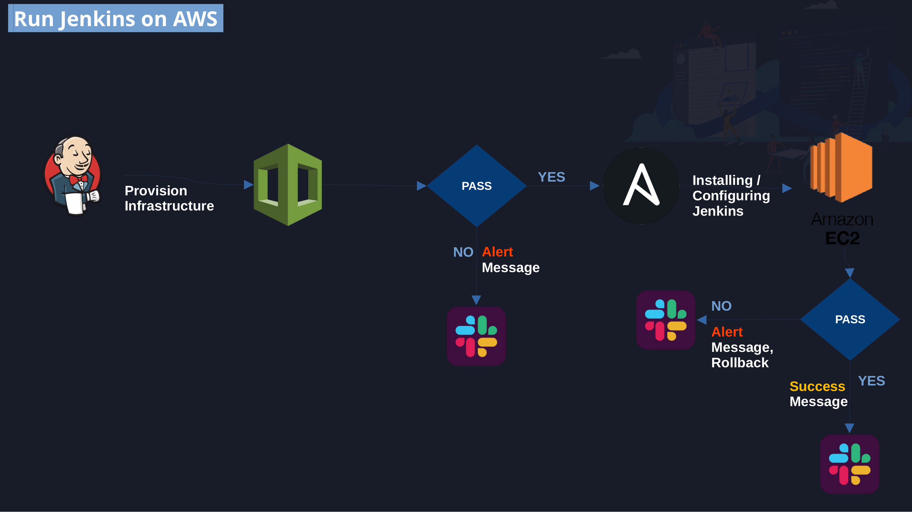

### Creating a pipeline to automate Jenkins installation and configuration on AWS using my local Jenkins server.

## Pipeline Diagram:

## Built with:
+ **Amazon Web Services (aws)**
+ **AWS CloudFormation**
+ **AWS CLI**
+ **Jenkins**
+ **Ansible**
+ **Slack**